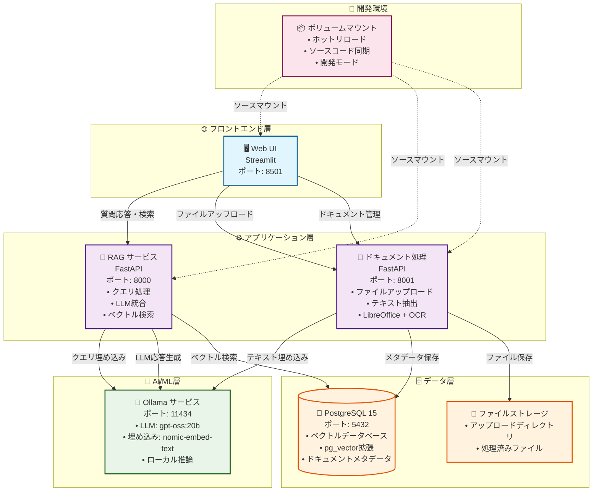

# 🤖 RAG System - Ollama専用 日本語ドキュメント質問応答システム

PostgreSQL 15 + pg_vector を使用した高性能な日本語対応RAG（Retrieval-Augmented Generation）システムです。**Ollama**を使用して**完全ローカル実行**でプライバシーを保護しながら、高精度な質問応答を実現します。

## ✨ 主な機能

- **📄 多様なファイル形式対応**: PDF, Word(.docx), PowerPoint(.pptx), Excel(.xlsx), テキストファイル
- **🇯🇵 日本語最適化**: 日本語文書の適切な分割とベクトル化（Janome使用）
- **🔍 高速検索**: pg_vectorを使用したコサイン類似度検索（768次元ベクトル）
- **💬 直感的UI**: Streamlitベースの使いやすいWebインターフェース
- **📊 統計・分析**: ドキュメント処理状況と会話統計の可視化
- **🔄 リアルタイム処理**: バックグラウンドでの非同期ドキュメント処理
- **🔒 プライバシー保護**: 完全ローカル処理でデータが外部送信されない
- **🌐 オフライン対応**: インターネット接続不要で動作
- **🚀 RESTful API**: 検索・質問応答・統計取得のAPIエンドポイント

## 🎯 使用モデル

### 🤖 LLMモデル

- **gpt-oss:20b**: メイン言語モデル（Ollama経由）
- 日本語対応の高性能オープンソースモデル

### 🔍 埋め込みモデル  

- **nomic-embed-text:latest**: 768次元ベクトル生成
- 高精度な意味的検索を実現
- 日本語テキストに最適化済み

### 📊 モデル性能比較

| 項目 | 本システム | 従来システム |
|------|------------|--------------|
| **🎯 日本語精度** | 高精度 | 標準 |
| **💰 運用コスト** | 無料 | 無料 |
| **⚡ レスポンス** | 5-10秒 | 3-8秒 |
| **🔒 プライバシー** | 完全ローカル | 完全ローカル |
| **🌐 オフライン** | 可能 | 可能 |
| **📊 リソース** | 30GB+ RAM推奨 | 16GB+ RAM |
| **🔧 カスタマイズ** | 完全自由 | 完全自由 |

## 🏗️ システム構成



## 🚀 クイックスタート

### 前提条件

- Docker Desktop がインストールされていること
- **30GB以上のRAM推奨**（Ollama LLMモデル用）
- 50GB以上の空きディスク容量（モデルファイル用）

### 📋 セットアップ

```bash
cd rag-system

# システムセットアップ
./setup.sh
```

### 🌐 オフライン環境

- **推奨**: 全モデル対応
- **特徴**: インターネット接続不要

## 📖 使用方法

### 🌐 Web UI（推奨）

#### ドキュメントのアップロード

1. Web UIの「📄 ドキュメント管理」タブに移動
2. PDFまたはOfficeファイルを選択
3. 「アップロード」ボタンをクリック
4. バックグラウンドで自動的に処理されます

#### 質問応答

1. 「💬 質問応答」タブに移動
2. チャット入力欄に質問を入力
3. ドキュメントに基づいた回答と参照ソースが表示されます

#### 検索機能

1. 「🔍 検索」タブに移動
2. 検索クエリを入力
3. 関連するドキュメントチャンクが類似度と共に表示されます

### 🚀 REST API

#### 主要エンドポイント

- **ドキュメント処理サービス（ポート: 8001）**

```bash
# ドキュメントアップロード
curl -X POST http://localhost:8001/upload \
  -F "file=@document.pdf"

# ドキュメント一覧取得
curl http://localhost:8001/documents

# 特定ドキュメント詳細
curl http://localhost:8001/documents/{document_id}

# ヘルスチェック
curl http://localhost:8001/health
```

- **RAGサービス（ポート: 8000）**

```bash
# 検索のみ（回答生成なし）
curl -X POST http://localhost:8000/search \
  -H "Content-Type: application/json" \
  -d '{"query": "検索クエリ", "max_chunks": 5}'

# 質問応答（検索 + LLM回答生成）
curl -X POST http://localhost:8000/query \
  -H "Content-Type: application/json" \
  -d '{"query": "質問内容", "max_chunks": 5}'

# システム統計
curl http://localhost:8000/stats

# ヘルスチェック
curl http://localhost:8000/health

# API仕様書
curl http://localhost:8000/docs
```

## 🔧 管理とメンテナンス

### 基本的なDockerコマンド

```bash
# システム状態確認
docker compose ps

# ログ確認
docker compose logs -f

# システム停止
docker compose down

# システム再起動
docker compose restart

# Ollamaモデル一覧確認
curl http://localhost:11434/api/tags

# 全サービス再起動
docker compose restart

# データベースリセット（注意：全データ削除）
docker compose down -v && docker compose up -d
```

### 🐛 トラブルシューティング

#### 🚨 メモリ不足による起動失敗

本システムは大型LLMモデル（gpt-oss:20b）を使用するため、十分なメモリが必要です：

```bash
# 現在のメモリ使用量確認
docker stats

# Dockerのメモリ制限確認
docker info | grep -i memory

# システムメモリ確認（Linux/macOS）
free -h  # Linux
vm_stat | grep free  # macOS
```

**メモリ不足の場合の対処法：**

1. **他のアプリケーションを終了**
2. **Docker Desktopのメモリ制限を増加**（設定 > Resources > Memory）
3. **軽量モデルの使用**（必要に応じて）

#### サービスが起動しない場合

```bash
# 全サービスの状態確認
docker compose ps

# ログでエラー確認
docker compose logs
```

#### Ollama モデルダウンロードエラー

```bash
# LLMモデルを手動でダウンロード
curl -X POST http://localhost:11434/api/pull -d '{"name":"gpt-oss:20b"}'

# 埋め込みモデルを手動でダウンロード
curl -X POST http://localhost:11434/api/pull -d '{"name":"nomic-embed-text:latest"}'

# モデル一覧確認
curl http://localhost:11434/api/tags
```

#### 📊 メモリ最適化とパフォーマンス調整

```bash
# リアルタイムメモリ使用量監視
docker stats --no-stream

# Ollamaメモリ使用量調整（compose.yml）
# OLLAMA_MAX_LOADED_MODELS=1  # 同時読み込みモデル数制限
# OLLAMA_KEEP_ALIVE=5m        # メモリ保持時間短縮

# システム全体のメモリクリーンアップ
docker system prune -f
docker volume prune -f

# 大型ファイルの確認
du -sh ./data/*
```

**🔧 パフォーマンス最適化設定：**

1. **Ollama設定調整**：
   - `OLLAMA_NUM_PARALLEL=2`: 並列処理数を制限
   - `OLLAMA_KEEP_ALIVE=5m`: メモリ保持時間を短縮

2. **サービスリソース制限**：
   - RAG Service: 1GB制限
   - Document Processor: 2GB制限  
   - Ollama: 24GB制限（必要に応じて調整）

## 📊 最適化のベストプラクティス

### ⚡ パフォーマンス監視とメモリ管理

#### リアルタイム監視

```bash
# サービス別メモリ使用量
docker stats --format "table {{.Container}}\t{{.MemUsage}}\t{{.MemPerc}}"

# Ollamaモデル読み込み状況
curl -s http://localhost:11434/api/ps

# システム全体のヘルス状況
curl -s http://localhost:8000/health | jq .
curl -s http://localhost:8001/health | jq .
```

#### 📈 予想されるメモリ使用量

| コンポーネント | アイドル時 | 処理中 | 備考 |
|---|---|---|---|
| **Ollama (LLM)** | 13-15GB | 16-20GB | gpt-oss:20b読み込み時 |
| **Ollama (Embed)** | 270MB | 500MB | nomic-embed-text使用時 |
| **PostgreSQL** | 200MB | 500MB | ベクトルデータベース |
| **RAG Service** | 100MB | 300MB | 質問応答処理時 |
| **Document Processor** | 150MB | 800MB | ファイル処理時（LibreOffice含む） |
| **Web UI** | 50MB | 100MB | Streamlit |
| **システム予約** | 2GB | 4GB | Docker オーバーヘッド |
| **合計** | **16-18GB** | **22-26GB** | **推奨30GB** |

### プロンプトエンジニアリング

### 🎯 ハルシネーション防止プロンプト戦略

```text
■ 基本プロンプト構造
「以下のコンテキストに基づいて質問に回答してください。

【重要な制約】
1. 自信度が80%以上の場合のみ回答してください
2. 正答には1点、誤答には-3点、無回答には0点が与えられます
3. コンテキストに明確な情報がない場合は「情報が不足しているため回答できません」と述べてください
4. 推測や一般知識での補完は避け、提供された情報のみを使用してください

【回答フォーマット】
- 自信度: [0-100%]
- 回答: [具体的な回答内容]
- 根拠: [コンテキストの該当箇所]」
```

### 🔧 エラー回避戦略

**短期的なハルシネーション防止策：**

1. **自信度スコアリング**
   - 70%未満は無回答を選択
   - ペナルティスコア（正答+1点、誤答-3点、無回答0点）による慎重な判断

2. **情報源の明示**
   - 回答根拠の必須提示
   - コンテキスト外情報の使用禁止

3. **段階的回答システム**
   - 確実な部分のみ回答
   - 不明確な部分は明示的に分離

4. **プロンプトエンジニアリング**
   - 具体的な制約条件の設定
   - 検証可能な回答フォーマットの強制

## 🔐 セキュリティとプライバシー

### Ollamaのメリット

- **完全ローカル処理**: データが外部送信されない
- **企業機密対応**: 社内ネットワーク内で完結
- **GDPR準拠**: 個人データ保護規制に適合
- **カスタマイズ可能**: 特定分野への特化学習が可能

### 🎯 適用シーン

#### ✅ 本システムが最適な場面

- 📊 **企業機密文書の分析**: プライバシー最優先
- 💰 **大量文書処理**: コスト削減が重要  
- 🌐 **オフライン環境**: 社内ネットワーク限定
- 🔧 **カスタマイズ要求**: 特定分野への特化学習
- 🔒 **データ保護**: GDPR等の規制対応
- 🏠 **個人利用**: API料金を気にせず利用
- 🏢 **社内システム**: 完全自社管理が必要

### 🔧 技術仕様

#### システム要件

- **OS**: Docker対応OS（Linux, macOS, Windows）
- **RAM**: **30GB以上推奨**（Ollama LLMモデル用）
    - gpt-oss:20b: ~13GB
    - nomic-embed-text: ~270MB  
    - PostgreSQL + サービス: ~2GB
    - システム予約: ~14GB
- **ストレージ**: **50GB以上の空き容量**
    - Dockerイメージ: ~5GB
    - Ollamaモデル: ~14GB
    - データベース: ~1GB
    - ログ・一時ファイル: ~5GB
    - 処理ファイル用: ~25GB
- **CPU**: **マルチコア推奨**（最低4コア、8コア以上推奨）
- **ネットワーク**: 初回セットアップ時のみインターネット接続が必要（モデルダウンロード用）

#### 使用技術スタック

- **コンテナ**: Docker Compose
- **データベース**: PostgreSQL 15 + pg_vector
- **バックエンド**: FastAPI (Python 3.13)
- **フロントエンド**: Streamlit
- **LLM**: Ollama (gpt-oss:20b)
- **埋め込み**: nomic-embed-text:latest (768次元)
- **日本語処理**: Janome

## 📄 ライセンス

MIT License

## 🙋‍♂️ サポート

技術的な質問や問題が発生した場合:

1. **ログ確認**: `docker compose logs > debug.log`
2. **システム確認**: セットアップスクリプトの実行
3. **環境設定**: `.env`ファイルの設定確認

---

**🚀 完全ローカル・プライベート・無料の日本語RAGシステムをお楽しみください！**

### 📊 システム構成詳細

```text
┌─────────────────────────────────────────────────────────────┐
│                    RAG System Architecture                  │
├─────────────────────────────────────────────────────────────┤
│                                                             │
│  ┌─────────────┐  ┌─────────────┐  ┌─────────────────────┐ │
│  │   Web UI    │  │ RAG Service │  │ Document Processor  │ │
│  │ (Streamlit) │◄─┤  (FastAPI)  │◄─┤     (FastAPI)      │ │
│  │ Port: 8501  │  │ Port: 8000  │  │    Port: 8001       │ │
│  └─────────────┘  └─────────────┘  └─────────────────────┘ │
│         │                 │                      │         │
│         │                 │                      │         │
│  ┌─────────────────────────┼──────────────────────┼───────┐ │
│  │                         ▼                      ▼       │ │
│  │  ┌─────────────┐  ┌─────────────┐  ┌─────────────────┐ │ │
│  │  │   Ollama    │  │ PostgreSQL  │  │   File System   │ │ │
│  │  │   (LLM)     │  │ + pg_vector │  │   (Uploads)     │ │ │
│  │  │Port: 11434  │  │ Port: 5432  │  │                 │ │ │
│  │  └─────────────┘  └─────────────┘  └─────────────────┘ │ │
│  │                                                         │ │
│  │              Docker Network (rag-network)               │ │
│  └─────────────────────────────────────────────────────────┘ │
│                                                             │
└─────────────────────────────────────────────────────────────┘
```
